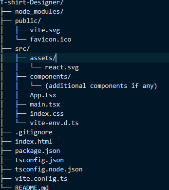

To run: use `npm run dev`

Setup: Project was directory made using `npm create vite@latest` using typescript and vanilla CSS.

Technologies used: React, Vite, CSS, Typescript.

# Install Dependencies:

`npm install react-hook-form`

# Project Directory Structure

## src/: Contains the source code of your application.
## assets/: Contains static assets like images, fonts, etc.
## react.svg: Example SVG file.
## components/: Optional directory for additional React components.
## App.tsx: Main React component.
## main.tsx: Entry point for the React application.
## index.css: Global styles for the application.
## vite-env.d.ts: TypeScript environment declarations for Vite.

# Overview:

The goal was to adapt an existing image to asci page to T-shirt design generator with image and text options, and dimensional information that a user might have, and us that to make T-shirts. This allows freedom of customization for the users.

## Development:

The main component contains the form, image upload and information display.

react-hook-form was used for form state and validation.

Drag-and-drop functionality implemented for image uploads, image preview is set to desired width and height(auto).

There are 4 functions that collectively handle image uploads, handleImageUpload(), handleDrop(), handleDragOver(), handleRemoveImage(). 

The drop area conditionally renders either the uploaded image with its name and a remove button or a label prompting the user to drop an image or click to upload.

# Use of AI: 

The original image to Ascii UI was copied and AI was prompted to analyze and explain the code.

SCSS code was converted to vanilla CSS using AI

Basic styles like the color variables, body styles, and component positioning were directly taken from the css file, some variables arent applied because the theme with alt+Q was built over the existing styles.

Layout for form inputs, image upload area and ASCII art display was directly taken from the html generation code in script.js. The HTML divs use i2a class because ImageToAscii word was used during generation of code snippets.

# Problems and fixes:

The final page had color and responsiveness issues. One issue was where the form fields in smaller screens, specifically below width 405px , would overflow out of the page scope. This was fixed by adding media queries to limit the size of the fields in small screens.

## The upload click event was dargdown functions were functional, but the dragdown did not change the state of the upload button on successful upload, added logic to handle the drop event, process the file and update state as necessary.

const handleDrop = (event: React.DragEvent<HTMLDivElement>) => {
  event.preventDefault();
  const file = event.dataTransfer.files?.[0];
  if (file) {
    const reader = new FileReader();
    reader.onload = (e) => {
      setImage(e.target?.result as string);
      setImageName(file.name);
    };
    reader.readAsDataURL(file);
  }
};

Added remove image functionality for better UX.

const handleRemoveImage = () => {
  setImage(null);
  setImageName('');
};

The codepen CSS was not set up to hangle multiple themes, some of the color variables in the scss file were interferinig with theme variables that were added using react-form-hooks describing primary and secondary colors, 

const themes = [
  { primaryColor: 'blue', backgroundColor: 'lightblue' },
  { primaryColor: 'green', backgroundColor: 'lightgreen' },
  { primaryColor: 'red', backgroundColor: 'lightcoral' },
];

The set themes are binded to the keys and the theme state is changed each time the keys are pressed, depending on previous theme.

useEffect(() => {
    const handleKeyDown = (event: KeyboardEvent) => {
      if (event.altKey && event.key === 'q') {
        setThemeIndex((prevIndex) => (prevIndex + 1) % themes.length);
      }
    };

    window.addEventListener('keydown', handleKeyDown);
    return () => window.removeEventListener('keydown', handleKeyDown);
  }, []);

  const theme = themes[themeIndex];
